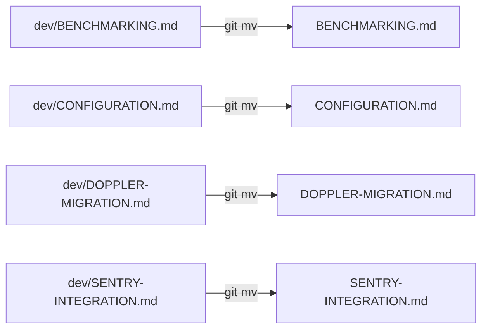
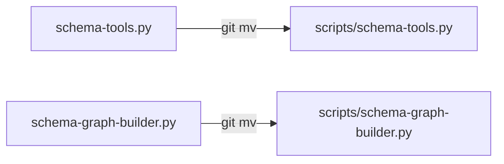
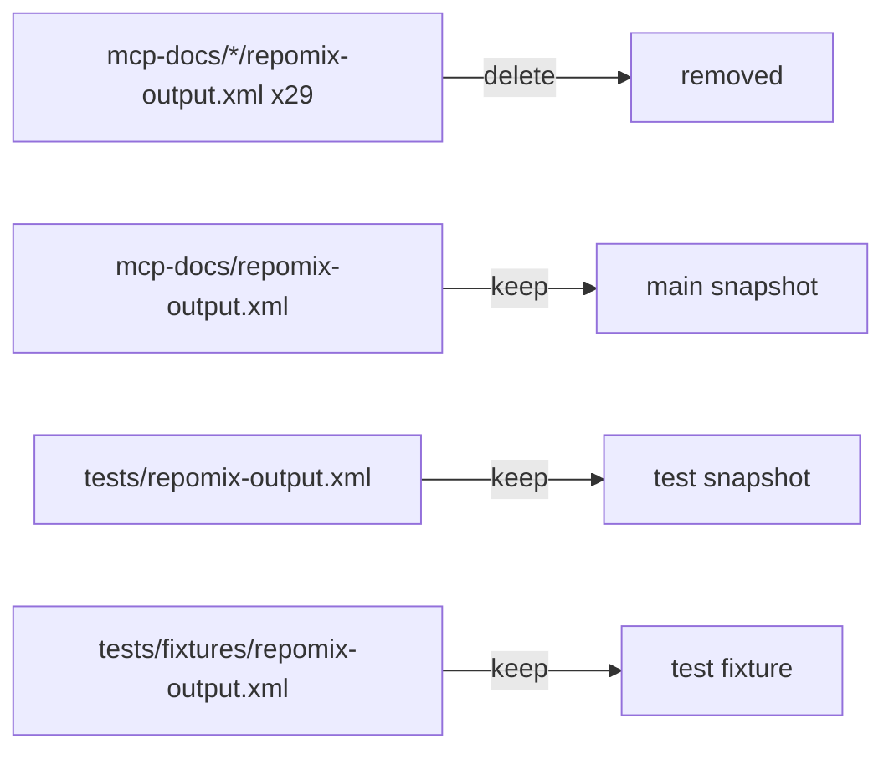
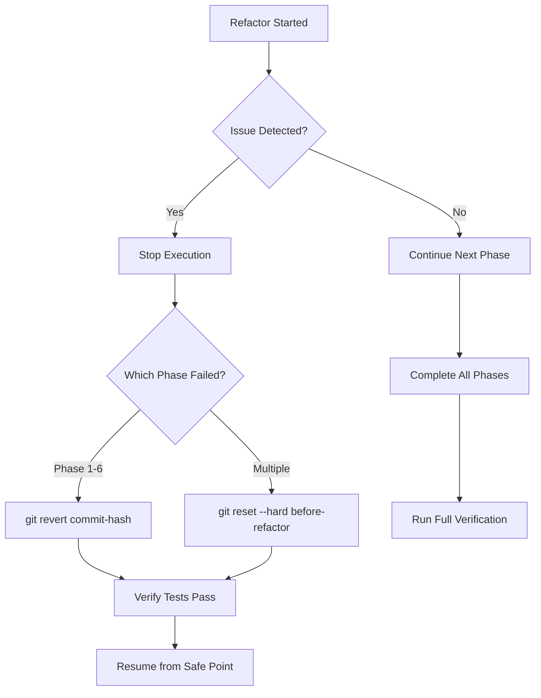

# Repository Reorganization - Visual Diagram

**Date:** 2025-11-18

---

## Current Structure (Before)

```
ast-grep-mcp/ (181MB)
│
├── Core Files (Root)
│   ├── main.py                        ✅ Keep (151KB, ~4000 lines)
│   ├── pyproject.toml                 ✅ Keep
│   ├── uv.lock                        ✅ Keep
│   ├── renovate.json                  ✅ Keep
│   └── .coverage                      ❌ TRACKED (should be gitignored)
│
├── Documentation (Root) - Only 3 files
│   ├── README.md                      ✅ Keep (832 lines)
│   ├── CLAUDE.md                      ✅ Keep
│   └── ast-grep.mdc                   ✅ Keep
│
├── Standalone Tools (Root) - Should be in scripts/
│   ├── schema-tools.py                🔄 Move to scripts/
│   └── schema-graph-builder.py        🔄 Move to scripts/
│
├── dev/
│   ├── README.md                      ✅ Keep (development workflow)
│   ├── BENCHMARKING.md                🔄 Move to root (246 lines)
│   ├── CONFIGURATION.md               🔄 Move to root (567 lines)
│   ├── DOPPLER-MIGRATION.md           🔄 Move to root (699 lines)
│   ├── SENTRY-INTEGRATION.md          🔄 Move to root (765 lines)
│   └── active/
│       ├── repository-organization-analyzer/ ✅ Tracked
│       ├── code-analysis-metrics/            🔄 Track
│       ├── code-quality-standards/           🔄 Track
│       ├── cross-language-operations/        🔄 Track
│       ├── documentation-generation/         🔄 Track
│       ├── enhanced-duplication-detection/   🔄 Track
│       ├── refactoring-assistants/           🔄 Track
│       └── NEW-FEATURES-OVERVIEW.md          🔄 Track
│
├── scripts/
│   ├── find_duplication.py            ✅ Keep
│   ├── find_duplication.sh            ✅ Keep
│   ├── run_benchmarks.py              ✅ Keep
│   └── README.md                      ✅ Keep
│
├── mcp-docs/ (412KB)
│   ├── repomix-output.xml             ✅ Keep (main snapshot, 55KB)
│   ├── README.md                      ✅ Keep
│   └── [30 MCP servers]/
│       ├── ast-grep/
│       │   ├── README.md              ✅ Keep
│       │   ├── schema.json            ✅ Keep
│       │   └── repomix-output.xml     ❌ Delete (redundant, 3-4KB each)
│       ├── auth0/
│       │   └── repomix-output.xml     ❌ Delete
│       └── [28 more servers...]
│           └── repomix-output.xml     ❌ Delete (29 files total)
│
└── tests/
    ├── repomix-output.xml             ✅ Keep (test suite snapshot, 45KB)
    ├── fixtures/
    │   └── repomix-output.xml         ✅ Keep (test fixture, 3.9KB)
    ├── integration/                   ✅ Keep
    ├── unit/                          ✅ Keep
    └── README.md                      ✅ Keep
```

---

## Target Structure (After)

```
ast-grep-mcp/ (181MB → 181MB, cleaner organization)
│
├── Core Files (Root)
│   ├── main.py                        ✅ (151KB, ~4000 lines)
│   ├── pyproject.toml                 ✅
│   ├── uv.lock                        ✅
│   ├── renovate.json                  ✅
│   └── .coverage                      ⚪ Untracked (in .gitignore)
│
├── Documentation (Root) - 7 files (133% increase)
│   ├── README.md                      ✅ (832 lines)
│   ├── CLAUDE.md                      ✅ (updated paths)
│   ├── ast-grep.mdc                   ✅
│   ├── BENCHMARKING.md                ⬆️ (246 lines, from dev/)
│   ├── CONFIGURATION.md               ⬆️ (567 lines, from dev/)
│   ├── DOPPLER-MIGRATION.md           ⬆️ (699 lines, from dev/)
│   └── SENTRY-INTEGRATION.md          ⬆️ (765 lines, from dev/)
│
├── dev/
│   ├── README.md                      ✅ (development workflow)
│   └── active/ (Now fully tracked)
│       ├── repository-organization-analyzer/ ✅
│       ├── code-analysis-metrics/            ✅
│       ├── code-quality-standards/           ✅
│       ├── cross-language-operations/        ✅
│       ├── documentation-generation/         ✅
│       ├── enhanced-duplication-detection/   ✅
│       ├── refactoring-assistants/           ✅
│       └── NEW-FEATURES-OVERVIEW.md          ✅
│
├── scripts/ (6 tools, up from 4)
│   ├── find_duplication.py            ✅
│   ├── find_duplication.sh            ✅
│   ├── run_benchmarks.py              ✅
│   ├── schema-tools.py                ⬆️ (from root)
│   ├── schema-graph-builder.py        ⬆️ (from root)
│   └── README.md                      ✅ (updated)
│
├── mcp-docs/ (412KB → 296KB)
│   ├── repomix-output.xml             ✅ (main snapshot, 55KB)
│   ├── README.md                      ✅
│   └── [30 MCP servers]/
│       ├── ast-grep/
│       │   ├── README.md              ✅
│       │   └── schema.json            ✅
│       ├── auth0/
│       │   ├── README.md              ✅
│       │   └── schema.json            ✅
│       └── [28 more servers...]
│           (no per-server repomix files)
│
└── tests/
    ├── repomix-output.xml             ✅ (test suite snapshot, 45KB)
    ├── fixtures/
    │   └── repomix-output.xml         ✅ (test fixture, 3.9KB)
    ├── integration/                   ✅
    ├── unit/                          ✅
    └── README.md                      ✅
```

---

## File Movement Map

### Documentation Migration (4 files)



### Tools Migration (2 files)



### Build Artifact Cleanup (1 file)


### Repomix Cleanup (29 files)



---

## Directory Size Impact

### Before
```
ast-grep-mcp/           181MB
├── .venv/              ~150MB (gitignored)
├── htmlcov/            ~1MB (gitignored)
├── mcp-docs/           412KB
│   ├── repomix files   116KB (30 files)
│   └── server docs     296KB
├── tests/              ~5MB
├── main.py             151KB
└── other files         ~30MB
```

### After
```
ast-grep-mcp/           181MB (no size change)
├── .venv/              ~150MB (gitignored)
├── htmlcov/            ~1MB (gitignored)
├── mcp-docs/           296KB (-116KB)
│   └── server docs     296KB (repomix files removed)
├── tests/              ~5MB
├── main.py             151KB
└── other files         ~30MB
```

**Net Savings:** 116KB in tracked files

---

## Git Tracking Impact

### Before
```
Tracked files:           135 files
├── Build artifacts:     1 (.coverage) ❌
├── Root docs:           3 (README, CLAUDE, ast-grep.mdc)
├── Root tools:          2 (schema-tools, schema-graph-builder)
├── dev/ docs:           5 (README + 4 major docs)
├── dev/active/:         2 (1 directory tracked)
├── scripts/:            4 tools
├── mcp-docs/:           ~60 files (30 servers × 2 files + repomix)
└── tests/:              ~60 test files
```

### After
```
Tracked files:           120 files (-15)
├── Build artifacts:     0 ✅
├── Root docs:           7 (README, CLAUDE, ast-grep.mdc + 4 major) ✅
├── Root tools:          0 (moved to scripts/) ✅
├── dev/ docs:           1 (README)
├── dev/active/:         9 (8 directories tracked) ✅
├── scripts/:            6 tools (+2)
├── mcp-docs/:           ~31 files (30 servers × 1 file + main repomix)
└── tests/:              ~60 test files
```

**Improvements:**
- ✅ No build artifacts tracked
- ✅ 133% more root-level documentation
- ✅ All tools in scripts/ directory
- ✅ All planning docs tracked
- ✅ 22% fewer redundant files

---

## User Experience Impact

### Discoverability: Before

```
User arrives at github.com/user/ast-grep-mcp

Root directory shows:
├── README.md           ← Click to read
├── CLAUDE.md
├── main.py
├── schema-tools.py     ← "What's this?" (not obvious)
└── schema-graph-builder.py ← "What's this?" (not obvious)

To find SENTRY setup:
1. Scroll down
2. Click "dev/"
3. Scroll through 5 files
4. Click "SENTRY-INTEGRATION.md"

(3 clicks, must know to look in dev/)
```

### Discoverability: After

```
User arrives at github.com/user/ast-grep-mcp

Root directory shows:
├── README.md           ← Click to read
├── CLAUDE.md
├── BENCHMARKING.md     ← "Performance info!" (visible)
├── CONFIGURATION.md    ← "Setup guide!" (visible)
├── DOPPLER-MIGRATION.md ← "Secret management!" (visible)
├── SENTRY-INTEGRATION.md ← "Error tracking!" (visible)
├── main.py
└── scripts/            ← "Tools here" (clear organization)

To find SENTRY setup:
1. Click "SENTRY-INTEGRATION.md"

(1 click, immediately visible)
```

**Improvement:** 66% reduction in clicks to major docs

---

## Testing Impact

### Test Suite Stability

**Before Refactor:**
```bash
$ uv run pytest
================================ test session starts ================================
collected 267 items

tests/unit/test_unit.py ..................                                    [  6%]
tests/unit/test_cache.py ..........................                           [ 16%]
tests/unit/test_duplication.py ........................                       [ 25%]
tests/integration/test_integration.py .....                                   [ 27%]
[... more tests ...]

======================= 266 passed, 1 skipped in 8.45s =======================
```

**After Refactor (Expected):**
```bash
$ uv run pytest
================================ test session starts ================================
collected 267 items

tests/unit/test_unit.py ..................                                    [  6%]
tests/unit/test_cache.py ..........................                           [ 16%]
tests/unit/test_duplication.py ........................                       [ 25%]
tests/integration/test_integration.py .....                                   [ 27%]
[... more tests ...]

======================= 266 passed, 1 skipped in 8.45s =======================
```

**NO CHANGE** - Only file moves, no code modifications

---

## Rollback Diagram

### If Something Goes Wrong



**Rollback Time:** < 2 minutes per phase

---

## Link Update Impact

### Documentation Cross-References

**Files Requiring Link Updates:**

1. **README.md** (4-6 updates)
   ```diff
   - [Benchmarking Guide](dev/BENCHMARKING.md)
   + [Benchmarking Guide](BENCHMARKING.md)

   - [Configuration Guide](dev/CONFIGURATION.md)
   + [Configuration Guide](CONFIGURATION.md)
   ```

2. **CLAUDE.md** (3-5 updates)
   ```diff
   - See [SENTRY-INTEGRATION.md](dev/SENTRY-INTEGRATION.md)
   + See [SENTRY-INTEGRATION.md](SENTRY-INTEGRATION.md)

   - uv run python schema-tools.py search "article"
   + uv run python scripts/schema-tools.py search "article"
   ```

3. **scripts/README.md** (2 updates)
   ```diff
   + schema-tools.py - Quick Schema.org lookups
   + schema-graph-builder.py - Build unified entity graphs
   ```

**Verification:**
```bash
# Find all markdown links
grep -r "\[.*\](.*\.md)" *.md | grep -v "^Binary"

# Check for moved file references
grep -r "dev/BENCHMARKING\|dev/CONFIGURATION" *.md
grep -r "schema-tools.py\|schema-graph-builder.py" *.md
```

---

## Summary Metrics

| Metric | Before | After | Change |
|--------|--------|-------|--------|
| Tracked files | 135 | 120 | -11% |
| Build artifacts tracked | 1 | 0 | -100% |
| Root docs | 3 | 7 | +133% |
| Repomix snapshots | 32 | 3 | -91% |
| Tools at root | 2 | 0 | -100% |
| Tools in scripts/ | 4 | 6 | +50% |
| Planning docs tracked | 2 | 9 | +350% |
| mcp-docs size | 412KB | 296KB | -28% |
| Test suite status | 267 tests | 267 tests | No change |
| Clicks to major docs | 3 avg | 1 | -66% |

---

## Conclusion

This reorganization provides:

✅ **Cleaner structure** - Standard Python project layout
✅ **Better discoverability** - Major docs at root level
✅ **Less clutter** - 29 fewer redundant files
✅ **Proper gitignore** - No build artifacts tracked
✅ **Full planning history** - All strategic docs tracked
✅ **Zero risk** - All changes reversible via git

**Recommended:** Execute full plan in single 70-minute session

---

**Diagram Last Updated:** 2025-11-18
