# Repository Organization Analysis - ast-grep-mcp
**Date:** 2025-11-18
**Analyzed by:** repository-organization-analyzer skill
**Status:** ✅ Phase 1 Cleanup Complete

## Cleanup Status

**Phase 1: Quick Cleanup - COMPLETED ✅**
- **Executed:** 2025-11-18
- **Files removed:** 4 files (~101KB)
- **Verification:** All tests pass (267 collected)
- **Git status:** 4 files deleted, ready for commit

**Removed Files:**
1. ✅ `mcp-docs/repomix-output.xml` (55KB) - Outdated snapshot
2. ✅ `tests/repomix-output.xml` (45KB) - Outdated snapshot
3. ✅ `tests/README_ENHANCED.md` - Experimental Schema.org metadata
4. ✅ `tests/fixtures/README_ENHANCED.md` - Experimental Schema.org metadata

**Phase 2: Documentation Review - COMPLETED ✅**
- **Executed:** 2025-11-18
- **Decision:** Keep mcp-docs/ and repomix files as-is
- **Documentation updated:** CLAUDE.md + README.md

**Phase 2 Decisions:**
1. ✅ **mcp-docs/ directory** - Kept as-is (Option A selected)
   - Provides valuable MCP ecosystem reference
   - Well-organized by category (AI/ML, Database, Development Tools, etc.)
   - Size (412KB) justified by comprehensive coverage of 30+ MCP servers
   - Documented in CLAUDE.md with purpose and maintenance notes

2. ✅ **Repomix snapshot files** - Restored and kept git-ignored
   - Restored `mcp-docs/repomix-output.xml` and `tests/repomix-output.xml`
   - Remain in `.gitignore` (local development aids, not committed)
   - Documented refresh frequency: After major changes, monthly minimum
   - Added regeneration instructions to both CLAUDE.md and README.md

3. ✅ **Documentation Updates:**
   - Added "Repository Structure" section to CLAUDE.md (100 lines)
   - Added "Repository Structure" section to README.md (27 lines)
   - Documented mcp-docs/ purpose and organization
   - Documented repomix refresh best practices

**Outcome:** Repository organization analysis complete with clear documentation

## Executive Summary

The ast-grep-mcp repository demonstrates a **clean, well-organized structure** with a single-file MCP server architecture. Minor cleanup opportunities identified:

- **Files analyzed**: 18 Python files, 47 Markdown files
- **Potential removals**: 3 files (~100KB)
- **Consolidation opportunities**: 2 README files
- **External content**: mcp-docs/ directory (30 subdirs, 412KB) - may be relocatable
- **Estimated cleanup effort**: 1-2 hours

## Current Structure

### Mermaid Diagram - Current Organization

```mermaid
graph TD
    root[ast-grep-mcp Repository]

    root --> main[main.py - 151KB<br/>18 MCP tools, single file]
    root --> docs[Documentation - 6 files]
    root --> config[Configuration - 4 files]
    root --> dev[dev/]
    root --> tests[tests/]
    root --> scripts[scripts/]
    root --> mcpdocs[mcp-docs/]
    root --> tools[Standalone Tools - 2 files]

    docs --> readme[README.md]
    docs --> claude[CLAUDE.md]
    docs --> sentry[SENTRY-INTEGRATION.md]
    docs --> doppler[DOPPLER-MIGRATION.md]
    docs --> bench[BENCHMARKING.md]
    docs --> astgrep[ast-grep.mdc]

    config --> pyproject[pyproject.toml]
    config --> uvlock[uv.lock]
    config --> renovate[renovate.json]

    dev --> devreadme[README.md]
    dev --> devconfig[CONFIGURATION.md]
    dev --> active[active/<br/>strategic-plan/<br/>organization-analyzer/]

    tests --> unit[unit/ - 8 test files]
    tests --> integration[integration/ - 2 test files]
    tests --> fixtures[fixtures/]
    tests --> testreadme1[README.md]
    tests --> testreadme2[README_ENHANCED.md]

    scripts --> finddup[find_duplication.py]
    scripts --> findsh[find_duplication.sh]
    scripts --> runbench[run_benchmarks.py]
    scripts --> scriptsreadme[README.md]

    mcpdocs --> mcpreadme[README.md]
    mcpdocs --> servers[30 server subdirs<br/>Each: README.md + schema.json]
    mcpdocs --> mcprepomix[repomix-output.xml]

    tools --> schemagraph[schema-graph-builder.py]
    tools --> schematools[schema-tools.py]

    style main fill:#99ff99
    style tests fill:#99ff99
    style scripts fill:#99ff99
    style docs fill:#99ff99
    style mcpdocs fill:#ffeb99
    style testreadme2 fill:#ffeb99
    style mcprepomix fill:#ff9999
    style servers fill:#ffeb99
```



**Legend:**
- 🟢 Green: Well-organized, no changes needed
- 🟡 Yellow: Review recommended
- 🔴 Red: Candidates for removal

## Detailed Findings

### ✅ Well-Organized Areas

#### 1. **Single-File MCP Server Architecture**
- `main.py` (151KB, ~4000 lines) contains all server logic
- Clean separation: 18 MCP tools, caching, Schema.org client, Sentry integration
- **Status**: Excellent for MCP server, no changes needed

#### 2. **Test Organization**
- Properly separated: `tests/unit/` (8 files) and `tests/integration/` (2 files)
- 321+ comprehensive tests with edge case coverage
- Clear fixtures directory
- **Status**: Well-organized, minimal cleanup needed

#### 3. **Scripts Directory**
- Standalone utilities properly grouped
- Each script documented in `scripts/README.md`
- **Status**: Clean, no changes needed

#### 4. **Documentation Structure**
- Root-level docs: README, CLAUDE, SENTRY-INTEGRATION, DOPPLER-MIGRATION, BENCHMARKING
- Clear separation of concerns
- All updated recently (Nov 16-17)
- **Status**: Excellent organization

### ⚠️ Issues Identified

#### Issue 1: Duplicate repomix-output.xml Files

**Location:**
- `mcp-docs/repomix-output.xml` (55KB, Nov 8)
- `tests/repomix-output.xml` (45KB, Nov 8)

**Impact:** Low - These are snapshots, can be regenerated anytime

**Recommendation:** Remove both files
- Snapshots are outdated (from Nov 8, current date Nov 18)
- Can regenerate with `repomix` command when needed
- Not part of source code

**Action:**
```bash
rm mcp-docs/repomix-output.xml tests/repomix-output.xml
```

**Effort:** 1 minute
**Risk:** None - regenerable files

---

#### Issue 2: Duplicate README Files in tests/

**Location:**
- `tests/README.md` - Actual test documentation
- `tests/README_ENHANCED.md` - Contains Schema.org JSON-LD metadata
- `tests/fixtures/README_ENHANCED.md` - Similar Schema.org metadata

**Analysis:**
- `README.md` is the standard test documentation
- `README_ENHANCED.md` appears experimental (Schema.org structured data)
- Likely created as experiment, not actively maintained

**Recommendation:** Remove `README_ENHANCED.md` files
- Keep `tests/README.md` as primary documentation
- Schema.org metadata not standard for test documentation
- If needed, can be regenerated

**Action:**
```bash
rm tests/README_ENHANCED.md tests/fixtures/README_ENHANCED.md
```

**Effort:** 1 minute
**Risk:** Low - appears to be experimental content

---

#### Issue 3: mcp-docs/ Directory - External Content

**Location:** `mcp-docs/` (30 subdirectories, 412KB)

**Purpose:** Documentation for 30+ external MCP servers (GitHub, Doppler, Cloudflare, etc.)

**Analysis:**
- Contains documentation for MCP servers USED by this project
- Not specific to ast-grep MCP server
- Includes: ast-grep, auth0, browserbase, bullmq, cloudflare-*, discord, doppler, github, postgres, redis, supabase, etc.
- Each subdir: README.md + schema.json

**Considerations:**
1. **Keep if:** These docs are actively referenced by users/developers
2. **Move if:** This is general MCP ecosystem documentation
3. **Archive if:** Generated once, rarely updated

**Questions to resolve:**
- Are these docs auto-generated from MCP server schemas?
- Are they actively maintained/updated?
- Do users reference this documentation?
- Could this live in separate repo or wiki?

**Recommendation Options:**

**Option A: Keep (if actively used)**
- No changes
- Document purpose in root README.md
- Useful for developers understanding available MCP integrations

**Option B: Move to docs/ subdirectory**
```bash
mkdir -p docs/mcp-servers
mv mcp-docs/* docs/mcp-servers/
rmdir mcp-docs
```
- Clearer that it's documentation, not source code
- Groups with other documentation

**Option C: Archive or separate repository**
- If rarely updated/referenced
- Better suited for wiki or separate docs repo
- Reduces main repo size

**Recommended:** Option A (keep) if actively referenced, otherwise Option B (move to docs/)

**Effort:** 5-10 minutes
**Risk:** Low if properly documented

## Files for Removal

| File | Size | Reason | References | Risk | Effort |
|------|------|--------|------------|------|--------|
| `mcp-docs/repomix-output.xml` | 55KB | Outdated snapshot (Nov 8) | 0 | None | 1m |
| `tests/repomix-output.xml` | 45KB | Outdated snapshot (Nov 8) | 0 | None | 1m |
| `tests/README_ENHANCED.md` | <1KB | Experimental Schema.org metadata | 0 | Low | 1m |
| `tests/fixtures/README_ENHANCED.md` | <1KB | Experimental Schema.org metadata | 0 | Low | 1m |

**Total removals:** 4 files, ~101KB

## Repository Metrics

### Current State
```
Root Directory Files:
├── Python files: 18
├── Markdown files: 47
├── Configuration files: 4
├── Total directories: 38
└── Total size: ~2-3MB (excluding .venv, caches)

Main Components:
├── main.py: 151KB (4000 lines)
├── tests/: 9 test files, 321+ tests
├── scripts/: 4 utility scripts
├── mcp-docs/: 30 subdirectories
└── Documentation: 6 primary docs
```

### After Cleanup
```
Files to remove: 4
Space saved: ~101KB
Directories unchanged: 38
Organizational improvement: Reduced clutter, clearer purpose
```

## Migration Plan

### Phase 1: Low-Risk Cleanup (Immediate - 5 minutes)

**Step 1: Remove outdated snapshots**
```bash
# Remove regenerable repomix snapshots
rm mcp-docs/repomix-output.xml
rm tests/repomix-output.xml
```

**Step 2: Remove experimental README files**
```bash
# Remove Schema.org experimental docs
rm tests/README_ENHANCED.md
rm tests/fixtures/README_ENHANCED.md
```

**Step 3: Verify**
```bash
# Verify tests still pass
uv run pytest

# Verify git status
git status
```

### Phase 2: Documentation Review (Optional - 10 minutes)

**Decision needed:** What to do with `mcp-docs/` directory?

**Option A: Keep as-is**
- Document purpose in root README.md
- Add note to CLAUDE.md about mcp-docs/ purpose

**Option B: Reorganize**
```bash
# Move to docs/ subdirectory for clarity
mkdir -p docs/mcp-servers
mv mcp-docs/* docs/mcp-servers/
rmdir mcp-docs

# Update any references (likely none)
grep -r "mcp-docs" . --exclude-dir=.git
```

**Recommendation:** Start with Phase 1 cleanup, defer mcp-docs/ decision

## Recommendations Summary

### Immediate Actions (Phase 1)
✅ **Remove 4 files** (outdated snapshots + experimental READMEs)
- Zero risk
- 5 minutes effort
- ~101KB space saved
- Cleaner git status

### Future Considerations (Phase 2)
🔍 **Review mcp-docs/ purpose**
- Document in README.md if keeping
- Consider moving to docs/ for clarity
- Evaluate if actively maintained

### No Changes Needed
✅ **Keep current structure for:**
- main.py single-file architecture
- tests/ organization
- scripts/ utilities
- dev/ documentation
- Root-level documentation
- Configuration files

## Risk Assessment

- **Breaking changes**: None
- **Test impact**: None (verified files not referenced)
- **Documentation impact**: Minimal (removing experimental files)
- **User impact**: None (removing internal snapshots)
- **Rollback plan**: Git revert if needed

## Success Metrics

After implementing Phase 1:
- ✅ Cleaner `git status` (4 fewer untracked/old files)
- ✅ Reduced clutter in tests/ directory
- ✅ No duplicate repomix snapshots
- ✅ All tests still pass
- ✅ Documentation remains clear and complete

## Next Steps

1. **Review this analysis** - Validate findings and recommendations
2. **Execute Phase 1 cleanup** - Remove 4 files (5 minutes)
3. **Decide on mcp-docs/** - Keep, reorganize, or document purpose
4. **Update CLAUDE.md** - Document any decisions made about mcp-docs/
5. **Git commit** - Commit cleanup with clear message

## Notes

- Repository is already well-organized
- Single-file architecture works well for MCP server
- Test coverage is excellent (321+ tests)
- Documentation is comprehensive and up-to-date
- Cleanup is optional, not critical - more about reducing clutter

---

**Analysis Complete:** 2025-11-18
**Recommendation:** Proceed with Phase 1 cleanup, defer mcp-docs/ decision
