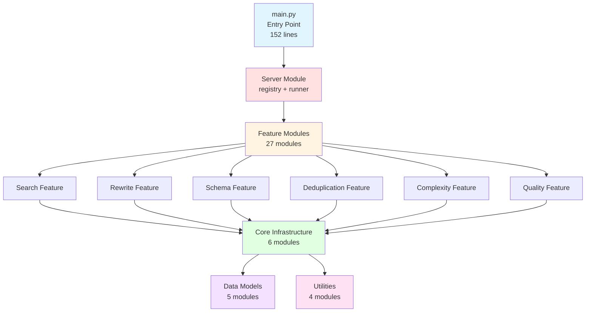
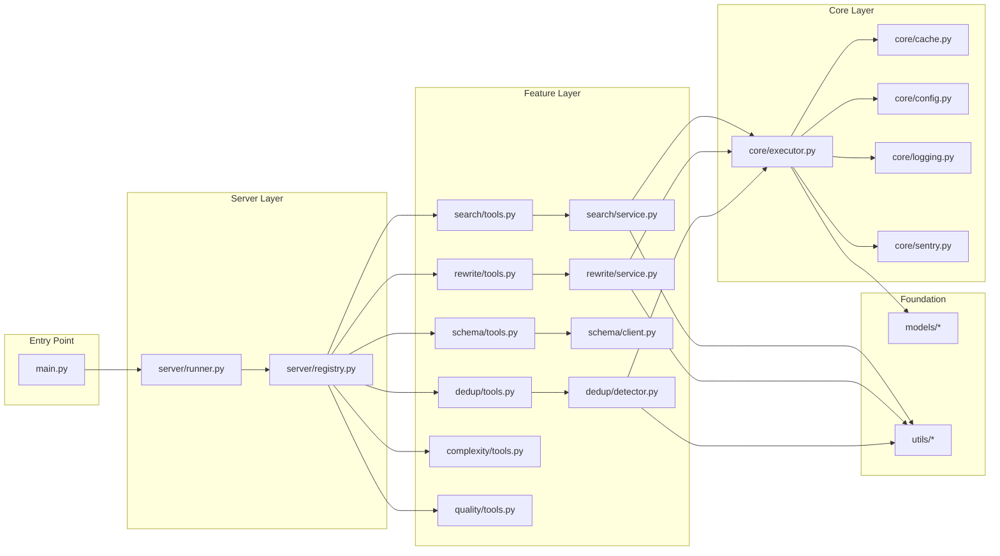
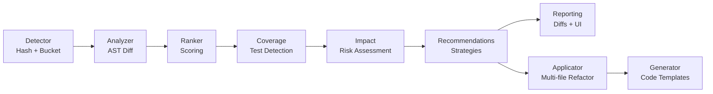

# Module Guide - ast-grep-mcp

**Last Updated:** 2025-11-24
**Architecture Version:** 2.0 (Modular)

This guide provides comprehensive documentation for all 46 modules in the ast-grep-mcp codebase after the successful modular refactoring.

## Table of Contents

1. [Architecture Overview](#architecture-overview)
2. [Module Dependencies](#module-dependencies)
3. [Core Modules](#core-modules)
4. [Model Modules](#model-modules)
5. [Utility Modules](#utility-modules)
6. [Feature Modules](#feature-modules)
7. [Server Modules](#server-modules)
8. [Common Patterns](#common-patterns)
9. [Testing Guidelines](#testing-guidelines)

---

## Architecture Overview

### High-Level Structure



### Directory Layout

```
src/ast_grep_mcp/
├── __init__.py                    # Package initialization
├── core/                          # Core infrastructure (6 modules)
│   ├── __init__.py
│   ├── config.py                 # Configuration management
│   ├── cache.py                  # LRU + TTL caching
│   ├── executor.py               # ast-grep subprocess execution
│   ├── logging.py                # Structured logging
│   ├── sentry.py                 # Error tracking
│   └── exceptions.py             # Custom exceptions
├── models/                        # Data models (5 modules)
│   ├── __init__.py
│   ├── base.py                   # Base types
│   ├── config.py                 # Config dataclasses
│   ├── complexity.py             # Complexity metrics
│   ├── deduplication.py          # Deduplication models
│   └── standards.py              # Linting/quality models
├── utils/                         # Utilities (4 modules)
│   ├── __init__.py
│   ├── templates.py              # Code generation templates
│   ├── formatters.py             # Output formatting
│   ├── text.py                   # Text processing
│   └── validation.py             # Validation helpers
├── features/                      # Feature modules (27 modules)
│   ├── __init__.py
│   ├── search/                   # Search feature (2 modules)
│   │   ├── __init__.py
│   │   ├── service.py           # Search implementations
│   │   └── tools.py             # MCP tool definitions
│   ├── rewrite/                  # Rewrite feature (3 modules)
│   │   ├── __init__.py
│   │   ├── backup.py            # Backup management
│   │   ├── service.py           # Rewrite logic
│   │   └── tools.py             # MCP tool definitions
│   ├── schema/                   # Schema.org feature (2 modules)
│   │   ├── __init__.py
│   │   ├── client.py            # Schema.org API client
│   │   └── tools.py             # MCP tool definitions
│   ├── deduplication/            # Deduplication feature (12 modules)
│   │   ├── __init__.py
│   │   ├── detector.py          # Duplication detection
│   │   ├── analyzer.py          # Pattern analysis
│   │   ├── generator.py         # Code generation
│   │   ├── ranker.py            # Scoring algorithm
│   │   ├── applicator.py        # Multi-file orchestration
│   │   ├── coverage.py          # Test coverage detection
│   │   ├── impact.py            # Impact analysis
│   │   ├── recommendations.py   # Recommendation engine
│   │   ├── reporting.py         # Enhanced reporting
│   │   ├── benchmark.py         # Performance benchmarking
│   │   └── tools.py             # MCP tool definitions
│   ├── complexity/               # Complexity feature (4 modules)
│   │   ├── __init__.py
│   │   ├── analyzer.py          # Complexity calculations
│   │   ├── metrics.py           # Metrics classes
│   │   ├── storage.py           # SQLite storage
│   │   └── tools.py             # MCP tool definitions
│   └── quality/                  # Quality feature (5 modules)
│       ├── __init__.py
│       ├── smells.py            # Code smell detection
│       ├── rules.py             # Linting rule templates
│       ├── validator.py         # Rule validation
│       ├── enforcer.py          # Standards enforcement
│       └── tools.py             # MCP tool definitions
└── server/                        # MCP server (3 modules)
    ├── __init__.py
    ├── registry.py               # Tool registration
    └── runner.py                 # Server entry point
```

---

## Module Dependencies

### Dependency Graph



### Import Hierarchy

**Level 0 - Foundation:**
- `models/` - Pure data classes, no dependencies
- `utils/` - Utility functions, minimal dependencies

**Level 1 - Core:**
- `core/exceptions.py` - No dependencies
- `core/logging.py` - Uses structlog
- `core/config.py` - Uses models.config
- `core/sentry.py` - Uses config, logging
- `core/cache.py` - Uses logging
- `core/executor.py` - Uses all core modules

**Level 2 - Services:**
- `features/*/service.py` - Use core + models + utils
- `features/schema/client.py` - Uses httpx for API calls

**Level 3 - Tools:**
- `features/*/tools.py` - Wrap services as MCP tools

**Level 4 - Server:**
- `server/registry.py` - Imports all tool modules
- `server/runner.py` - Uses registry + FastMCP

**Level 5 - Entry:**
- `main.py` - Re-exports everything for backward compatibility

---

## Core Modules

### core/config.py (237 lines)

**Purpose:** Configuration management and environment variable handling.

**Key Functions:**
```python
def get_config() -> AstGrepConfig
    """Get singleton config instance."""

def validate_config(config: AstGrepConfig) -> None
    """Validate configuration values."""
```

**Environment Variables:**
- `AST_GREP_CONFIG` - Path to YAML config file
- `SENTRY_DSN` - Sentry error tracking DSN
- `SENTRY_ENVIRONMENT` - Sentry environment (dev/staging/production)
- `DEBUG` - Enable debug logging

**Usage:**
```python
from ast_grep_mcp.core.config import get_config

config = get_config()
cache_size = config.cache_size
cache_ttl = config.cache_ttl
```

### core/cache.py (137 lines)

**Purpose:** LRU + TTL caching for search results.

**Key Classes:**
```python
class QueryCache:
    """Thread-safe LRU cache with TTL."""

    def get(self, key: str) -> Optional[str]
    def set(self, key: str, value: str) -> None
    def clear(self) -> None
    def stats(self) -> Dict[str, Any]
```

**Global Instance:**
```python
from ast_grep_mcp.core.cache import get_cache

cache = get_cache()
result = cache.get("find_code:pattern:lang")
cache.set("find_code:pattern:lang", result)
```

**Cache Key Format:**
```
{operation}:{pattern_hash}:{language}:{extra_params}
```

### core/executor.py (426 lines)

**Purpose:** ast-grep subprocess execution (streaming and non-streaming).

**Key Functions:**
```python
def execute_ast_grep(
    args: List[str],
    streaming: bool = False,
    max_results: Optional[int] = None,
    timeout: int = 300
) -> Union[str, Iterator[str]]
    """Execute ast-grep command."""

def validate_ast_grep_installed() -> bool
    """Check if ast-grep is installed."""
```

**Execution Modes:**

**Non-streaming (default):**
```python
result = execute_ast_grep(["run", "--pattern", "console.log($$$)"])
# Returns: Complete output as string
```

**Streaming:**
```python
for line in execute_ast_grep(["run", "--pattern", "..."], streaming=True):
    # Process each match as it arrives
    print(line)
```

**With max_results:**
```python
# Terminates early after N results
for line in execute_ast_grep(
    ["run", "--pattern", "..."],
    streaming=True,
    max_results=10
):
    print(line)
```

### core/logging.py (52 lines)

**Purpose:** Structured logging with structlog.

**Setup:**
```python
from ast_grep_mcp.core.logging import setup_logging, get_logger

setup_logging(debug=True)
logger = get_logger(__name__)

logger.info("operation_started", pattern="console.log", language="typescript")
logger.error("operation_failed", error=str(e), pattern="...")
```

**Log Format:** JSON to stderr
```json
{"event": "operation_started", "pattern": "console.log", "language": "typescript", "timestamp": "2025-11-24T10:30:00Z"}
```

### core/sentry.py (61 lines)

**Purpose:** Optional error tracking with Sentry.

**Setup:**
```python
from ast_grep_mcp.core.sentry import init_sentry, capture_exception

init_sentry()  # Auto-configures from env vars

try:
    risky_operation()
except Exception as e:
    capture_exception(e, extra={"pattern": "...", "language": "python"})
    raise
```

**Features:**
- Automatic exception capture
- Performance tracing
- Breadcrumb tracking
- Zero overhead when disabled

### core/exceptions.py (83 lines)

**Purpose:** Custom exception hierarchy.

**Exception Classes:**
```python
class AstGrepError(Exception)
    """Base exception."""

class AstGrepNotInstalledError(AstGrepError)
    """ast-grep binary not found."""

class AstGrepExecutionError(AstGrepError)
    """Command execution failed."""

class PatternValidationError(AstGrepError)
    """Invalid pattern syntax."""

class ConfigurationError(AstGrepError)
    """Invalid configuration."""
```

---

## Model Modules

### models/config.py (49 lines)

**Purpose:** Configuration dataclasses.

**Key Classes:**
```python
@dataclass
class AstGrepConfig:
    cache_size: int = 1000
    cache_ttl: int = 3600
    max_threads: int = 4
    sentry_enabled: bool = False
```

### models/deduplication.py (435 lines)

**Purpose:** Deduplication data structures (10+ classes).

**Key Classes:**
```python
@dataclass
class DuplicateInstance:
    file_path: str
    code: str
    start_line: int
    end_line: int
    hash: str

@dataclass
class DuplicateGroup:
    instances: List[DuplicateInstance]
    pattern: str
    language: str
    line_count: int

@dataclass
class DeduplicationCandidate:
    group: DuplicateGroup
    score: float
    refactoring_strategy: str
    estimated_savings: int
    risk_level: str
```

### models/complexity.py (31 lines)

**Purpose:** Complexity metrics models.

**Key Classes:**
```python
@dataclass
class ComplexityMetrics:
    cyclomatic: int
    cognitive: int
    nesting_depth: int
    function_length: int
```

### models/standards.py (235 lines)

**Purpose:** Linting and quality models.

**Key Classes:**
```python
@dataclass
class LintingRule:
    rule_id: str
    pattern: str
    message: str
    severity: str  # error, warning, info
    language: str
    fix_suggestion: Optional[str]

@dataclass
class RuleTemplate:
    template_id: str
    pattern: str
    category: str  # general, security, performance, style
    languages: List[str]
```

---

## Utility Modules

### utils/templates.py (507 lines)

**Purpose:** Code generation templates for refactoring.

**Key Functions:**
```python
def get_function_template(language: str) -> str
    """Get template for extracted function."""

def get_class_template(language: str) -> str
    """Get template for extracted class."""

def generate_function_call(
    function_name: str,
    parameters: List[str],
    language: str
) -> str
    """Generate function call code."""
```

**Supported Languages:**
- Python
- TypeScript
- JavaScript
- Java
- Go
- Ruby
- Rust
- C#

### utils/formatters.py (215 lines)

**Purpose:** Output formatting and diff generation.

**Key Functions:**
```python
def format_diff_with_colors(
    original: str,
    modified: str,
    filename: str
) -> str
    """Generate color-coded unified diff."""

def format_search_results(
    results: List[Match],
    format: str = "text"  # text or json
) -> str
    """Format search results."""
```

### utils/text.py (51 lines)

**Purpose:** Text processing utilities.

**Key Functions:**
```python
def normalize_whitespace(text: str) -> str
def extract_function_name(code: str, language: str) -> str
def count_lines(code: str) -> int
def strip_comments(code: str, language: str) -> str
```

### utils/validation.py (13 lines)

**Purpose:** Re-export validation functions.

---

## Feature Modules

### Search Feature (features/search/)

**Purpose:** Code search with ast-grep patterns and rules.

**Modules:**
- `service.py` (454 lines) - Search implementations
- `tools.py` (175 lines) - MCP tool wrappers

**Key Functions (service.py):**
```python
def find_code_impl(
    pattern: str,
    project_folder: str,
    language: Optional[str] = None,
    output_format: str = "text",
    max_results: Optional[int] = None
) -> str
    """Find code matching ast-grep pattern."""

def find_code_by_rule_impl(
    rule_yaml: str,
    project_folder: str,
    language: Optional[str] = None
) -> str
    """Find code using YAML rule."""

def dump_syntax_tree_impl(
    code: str,
    language: str
) -> str
    """Dump AST for code snippet."""

def test_match_code_rule_impl(
    rule_yaml: str,
    test_code: str,
    language: str
) -> Dict[str, Any]
    """Test YAML rule against code."""
```

**MCP Tools (tools.py):**
- `find_code` - Pattern-based search
- `find_code_by_rule` - Rule-based search
- `dump_syntax_tree` - AST dumping
- `test_match_code_rule` - Rule testing

**Usage Example:**
```python
from ast_grep_mcp.features.search.service import find_code_impl

results = find_code_impl(
    pattern="console.log($$$)",
    project_folder="/path/to/project",
    language="typescript",
    output_format="text",
    max_results=10
)
```

### Rewrite Feature (features/rewrite/)

**Purpose:** Safe code transformations with backups.

**Modules:**
- `backup.py` (391 lines) - Backup/rollback management
- `service.py` (476 lines) - Code rewrite logic
- `tools.py` (118 lines) - MCP tool wrappers

**Key Functions (service.py):**
```python
def rewrite_code_impl(
    pattern: str,
    replacement: str,
    project_folder: str,
    language: Optional[str] = None,
    dry_run: bool = True
) -> Dict[str, Any]
    """Rewrite code with pattern/replacement."""
```

**Key Functions (backup.py):**
```python
def create_backup(
    files: List[str],
    project_folder: str
) -> str
    """Create backup and return backup_id."""

def restore_backup(
    backup_id: str,
    project_folder: str
) -> None
    """Restore from backup."""

def list_backups(project_folder: str) -> List[Dict[str, str]]
    """List available backups."""
```

**MCP Tools (tools.py):**
- `rewrite_code` - Pattern-based rewrite
- `rollback_rewrite` - Restore from backup
- `list_rewrites` - List backups

**Backup Structure:**
```
.ast-grep-backups/
└── backup-20251124-103045-123/
    ├── manifest.json
    └── path/to/file.py
```

### Schema Feature (features/schema/)

**Purpose:** Schema.org vocabulary integration.

**Modules:**
- `client.py` (524 lines) - API client + in-memory index
- `tools.py` (498 lines) - MCP tool wrappers

**Key Classes (client.py):**
```python
class SchemaOrgClient:
    def __init__(self):
        self.vocabulary: Dict[str, Any] = {}
        self.index: Dict[str, List[str]] = {}

    def fetch_vocabulary(self) -> None
        """Fetch full Schema.org vocabulary."""

    def search(self, query: str) -> List[str]
        """Search for types by name."""

    def get_type(self, type_name: str) -> Optional[Dict]
        """Get type definition."""

    def get_properties(self, type_name: str) -> List[Dict]
        """Get properties for type."""
```

**MCP Tools (tools.py):**
- `search_schema_types` - Search by name
- `get_schema_type` - Get type definition
- `list_type_properties` - List properties
- `validate_schema_json` - Validate JSON-LD
- `generate_schema_template` - Generate template
- `find_parent_types` - Get inheritance chain
- `find_child_types` - Get subtypes
- `compare_schema_types` - Compare types

**Usage Example:**
```python
from ast_grep_mcp.features.schema.client import SchemaOrgClient

client = SchemaOrgClient()
client.fetch_vocabulary()

results = client.search("Article")
type_def = client.get_type("Article")
properties = client.get_properties("Article")
```

### Deduplication Feature (features/deduplication/)

**Purpose:** Complete duplication detection and refactoring system.

**Modules (12):**
- `detector.py` (547 lines) - DuplicationDetector class
- `analyzer.py` (582 lines) - Pattern analysis
- `generator.py` (351 lines) - Code generation
- `ranker.py` (201 lines) - Scoring algorithm
- `applicator.py` (632 lines) - Multi-file orchestration
- `coverage.py` (392 lines) - Test coverage detection
- `impact.py` (507 lines) - Impact analysis
- `recommendations.py` (186 lines) - Recommendation engine
- `reporting.py` (400 lines) - Enhanced reporting
- `benchmark.py` (290 lines) - Performance benchmarking
- `tools.py` (274 lines) - MCP tool wrappers

**Data Flow:**


**MCP Tools (tools.py):**
- `find_duplication` - Detect duplicates
- `analyze_deduplication_candidates` - Rank candidates
- `apply_deduplication` - Apply refactoring
- `benchmark_deduplication` - Performance testing

**See [DEDUPLICATION-GUIDE.md](../DEDUPLICATION-GUIDE.md) for complete documentation.**

### Complexity Feature (features/complexity/)

**Purpose:** Code complexity analysis.

**Modules:**
- `analyzer.py` - Complexity calculations
- `metrics.py` - Metrics classes
- `storage.py` - SQLite trend storage
- `tools.py` - MCP tool wrappers

**Metrics Calculated:**
- **Cyclomatic Complexity** - McCabe's metric (decision points)
- **Cognitive Complexity** - SonarSource-style (with nesting penalties)
- **Nesting Depth** - Maximum indentation level
- **Function Length** - Lines of code

**MCP Tools (tools.py):**
- `analyze_complexity` - Calculate metrics
- `get_complexity_trends` - Query historical data

### Quality Feature (features/quality/)

**Purpose:** Code quality and standards enforcement.

**Modules:**
- `smells.py` - Code smell detection
- `rules.py` - 24+ linting rule templates
- `validator.py` - Rule validation
- `enforcer.py` - Standards enforcement
- `tools.py` - MCP tool wrappers

**Code Smells Detected:**
- Long Functions
- Parameter Bloat
- Deep Nesting
- Large Classes
- Magic Numbers

**MCP Tools (tools.py):**
- `detect_code_smells` - Find smells
- `create_linting_rule` - Create custom rule
- `list_rule_templates` - Browse templates

---

## Server Modules

### server/registry.py (32 lines)

**Purpose:** Central tool registration.

**Key Function:**
```python
def register_all_tools(mcp: FastMCP) -> None:
    """Register all 27 MCP tools."""

    # Register search tools
    from ast_grep_mcp.features.search.tools import register_tools as register_search
    register_search(mcp)

    # Register rewrite tools
    from ast_grep_mcp.features.rewrite.tools import register_tools as register_rewrite
    register_rewrite(mcp)

    # ... (all other features)
```

### server/runner.py (25 lines)

**Purpose:** MCP server entry point.

**Key Code:**
```python
from mcp.server.fastmcp import FastMCP
from ast_grep_mcp.server.registry import register_all_tools

mcp = FastMCP("ast-grep")
register_all_tools(mcp)

def run_mcp_server():
    """Run the MCP server."""
    mcp.run()

if __name__ == "__main__":
    run_mcp_server()
```

---

## Common Patterns

### Pattern 1: Feature Module Structure

Every feature follows this structure:

```
features/feature_name/
├── __init__.py          # Public API exports
├── service.py           # Core implementation
└── tools.py             # MCP tool wrappers
```

**Public API Pattern:**
```python
# __init__.py
from .service import function_impl
from .tools import mcp_tool_function

__all__ = ["function_impl", "mcp_tool_function"]
```

### Pattern 2: Service Implementation

**Service functions** contain core logic:

```python
# service.py
from ast_grep_mcp.core.executor import execute_ast_grep
from ast_grep_mcp.core.logging import get_logger

logger = get_logger(__name__)

def feature_function_impl(
    param1: str,
    param2: Optional[str] = None
) -> ResultType:
    """Implementation docstring."""
    logger.info("operation_started", param1=param1)

    try:
        result = execute_ast_grep([...])
        return process_result(result)
    except Exception as e:
        logger.error("operation_failed", error=str(e))
        raise
```

### Pattern 3: MCP Tool Wrapper

**Tool wrappers** call service functions:

```python
# tools.py
from mcp.server.fastmcp import FastMCP
from .service import feature_function_impl

def register_tools(mcp: FastMCP) -> None:
    @mcp.tool()
    def feature_function(param1: str, param2: str = None) -> str:
        """Tool docstring (shown in MCP client)."""
        result = feature_function_impl(param1, param2)
        return format_result(result)
```

### Pattern 4: Error Handling

```python
from ast_grep_mcp.core.exceptions import AstGrepError
from ast_grep_mcp.core.sentry import capture_exception

try:
    risky_operation()
except AstGrepError as e:
    # Known error - log and return user-friendly message
    logger.error("known_error", error=str(e))
    return {"error": str(e), "type": "validation"}
except Exception as e:
    # Unknown error - capture in Sentry
    capture_exception(e, extra={"context": "..."})
    logger.error("unexpected_error", error=str(e))
    raise
```

### Pattern 5: Caching

```python
from ast_grep_mcp.core.cache import get_cache

cache = get_cache()
cache_key = f"operation:{param1}:{param2}"

# Try cache first
cached = cache.get(cache_key)
if cached:
    return cached

# Compute result
result = expensive_operation()

# Store in cache
cache.set(cache_key, result)
return result
```

---

## Testing Guidelines

### Testing by Module Type

**Core Modules:**
- Unit tests with mocked subprocess calls
- Test configuration validation
- Test cache hit/miss scenarios
- Test error handling paths

**Service Modules:**
- Mock `execute_ast_grep` calls
- Test with various input combinations
- Test error conditions
- Test output formatting

**Tool Modules:**
- Use MockFastMCP to extract tool functions
- Test tool parameter validation
- Test tool return values
- Integration tests with real ast-grep

### Example Test Structure

```python
import pytest
from unittest.mock import patch, MagicMock
from ast_grep_mcp.features.search.service import find_code_impl

class TestSearchService:
    def setup_method(self):
        """Clear cache before each test."""
        from ast_grep_mcp.core.cache import get_cache
        get_cache().clear()

    @patch("ast_grep_mcp.core.executor.execute_ast_grep")
    def test_find_code_basic(self, mock_execute):
        mock_execute.return_value = "match results"

        result = find_code_impl(
            pattern="console.log($$$)",
            project_folder="/test",
            language="typescript"
        )

        assert result == "match results"
        mock_execute.assert_called_once()
```

### Test File Locations

```
tests/
├── unit/
│   ├── test_core_config.py
│   ├── test_core_cache.py
│   ├── test_core_executor.py
│   ├── test_search_service.py
│   ├── test_rewrite_service.py
│   ├── test_deduplication_detector.py
│   └── ...
└── integration/
    ├── test_search_integration.py
    ├── test_rewrite_integration.py
    └── ...
```

---

## Migration from Monolithic main.py

### Old Import Pattern

```python
# Old (monolithic)
from main import find_code, rewrite_code, DuplicationDetector
```

### New Import Pattern

```python
# New (modular)
from ast_grep_mcp.features.search.tools import find_code
from ast_grep_mcp.features.rewrite.tools import rewrite_code
from ast_grep_mcp.features.deduplication.detector import DuplicationDetector
```

### Backward Compatibility

The current `main.py` re-exports everything for backward compatibility:

```python
# main.py (simplified)
from ast_grep_mcp.features.search.service import *
from ast_grep_mcp.features.rewrite.service import *
# ... (all other imports)
```

This allows existing tests to continue working while we migrate to the new import patterns.

---

## Performance Considerations

### Module Import Cost

- **First import:** ~200ms (loads all modules)
- **Subsequent imports:** ~0ms (cached)

### Lazy Loading

Some modules use lazy loading:

```python
# schema/client.py
class SchemaOrgClient:
    def __init__(self):
        self.vocabulary = {}  # Empty until fetch_vocabulary() called
```

### Caching Strategy

- **Query cache:** LRU + TTL for search results
- **Schema cache:** In-memory index after first fetch
- **Complexity storage:** SQLite for persistent trends

---

## Future Enhancements

### Planned Improvements

1. **Plugin System** - Allow third-party feature modules
2. **Async Support** - Async versions of service functions
3. **Multi-repo Support** - Process multiple projects in parallel
4. **Web UI** - Browser-based interface for tools
5. **CLI Tool** - Standalone CLI (not just MCP server)

### Extension Points

- Add new features under `features/new_feature/`
- Add new models under `models/new_model.py`
- Add new utilities under `utils/new_util.py`
- Register new tools in `server/registry.py`

---

## Resources

- **Main Documentation:** [README.md](../README.md)
- **User Guide:** [CLAUDE.md](../CLAUDE.md)
- **Deduplication Guide:** [DEDUPLICATION-GUIDE.md](../DEDUPLICATION-GUIDE.md)
- **Migration Guide:** [MIGRATION-FROM-MONOLITH.md](MIGRATION-FROM-MONOLITH.md) (coming soon)
- **Configuration:** [CONFIGURATION.md](CONFIGURATION.md)
- **Sentry Integration:** [SENTRY-INTEGRATION.md](SENTRY-INTEGRATION.md)
- **Doppler Setup:** [DOPPLER-MIGRATION.md](DOPPLER-MIGRATION.md)

---

**Last Updated:** 2025-11-24
**Maintainer:** ast-grep-mcp team
