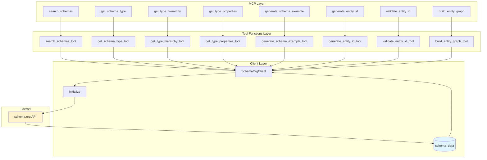
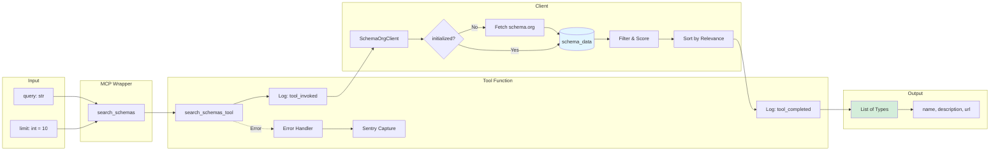
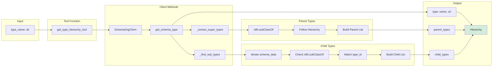
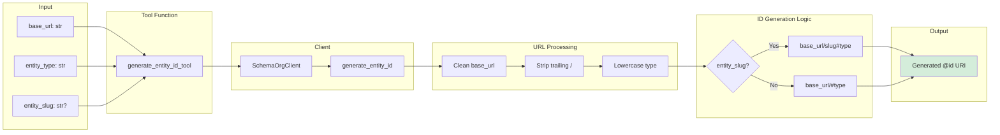
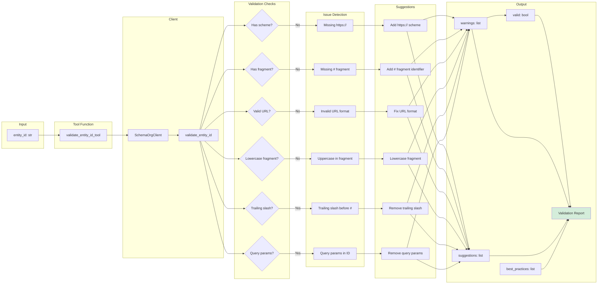
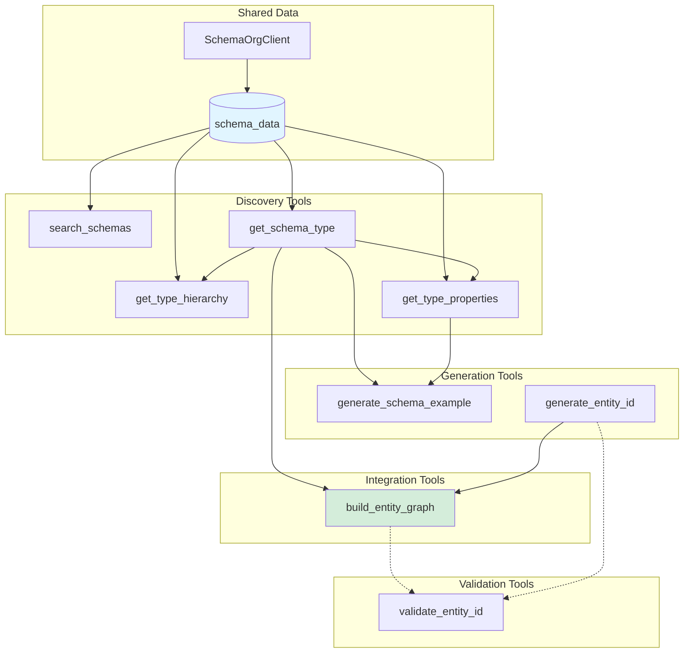
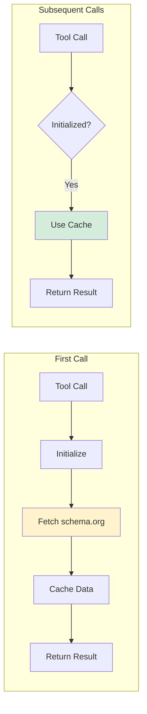
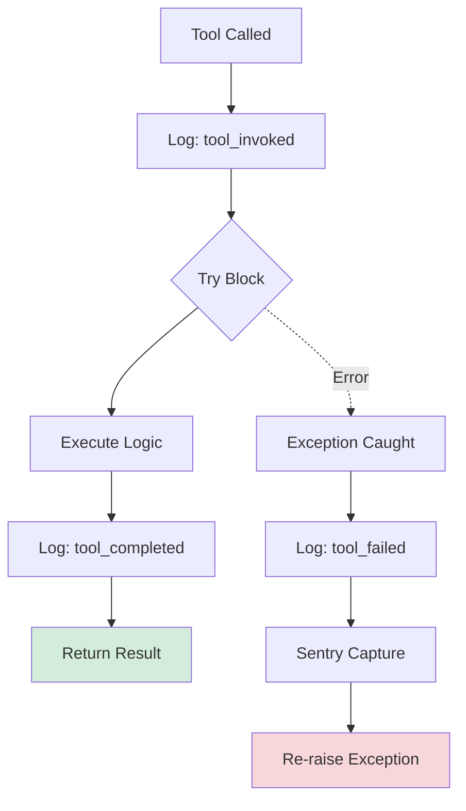
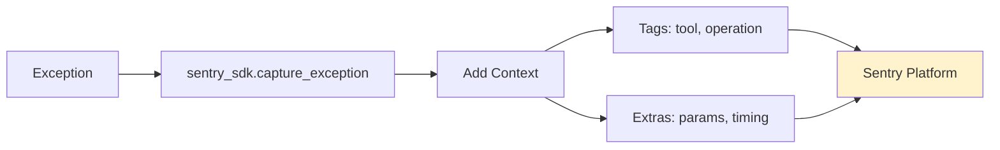

# Schema.org Integration - Data Flow Diagrams

This document visualizes the data flow for all 8 Schema.org MCP tools, showing how data moves through the system and how tools interact with each other.

## Table of Contents

- [Architecture Overview](#architecture-overview)
- [Tool 1: search_schemas](#tool-1-search_schemas)
- [Tool 2: get_schema_type](#tool-2-get_schema_type)
- [Tool 3: get_type_hierarchy](#tool-3-get_type_hierarchy)
- [Tool 4: get_type_properties](#tool-4-get_type_properties)
- [Tool 5: generate_schema_example](#tool-5-generate_schema_example)
- [Tool 6: generate_entity_id](#tool-6-generate_entity_id)
- [Tool 7: validate_entity_id](#tool-7-validate_entity_id)
- [Tool 8: build_entity_graph](#tool-8-build_entity_graph)
- [Cross-Tool Data Flow](#cross-tool-data-flow)

---

## Architecture Overview



**Layered Architecture:**
1. **MCP Layer**: FastMCP-decorated wrapper functions with Pydantic Field validation
2. **Tool Functions Layer**: Standalone implementation functions with logging and Sentry integration
3. **Client Layer**: SchemaOrgClient with cached schema.org vocabulary data
4. **External**: Schema.org JSONLD API (fetched once, cached)

---

## Tool 1: search_schemas

**Purpose:** Search for Schema.org types by keyword in names and descriptions.



**Data Flow Steps:**
1. **Input Validation**: Query string and limit (1-100)
2. **Initialization Check**: Ensure schema.org data is loaded
3. **Search Algorithm**:
   - Filter types by query match in `rdfs:label` or `rdfs:comment`
   - Score matches (exact > partial)
   - Sort by relevance score
4. **Result Limiting**: Return top N results (default 10)
5. **Output**: List of matching types with name, description, URL

**Example:**
```python
search_schemas_tool(query="blog", limit=5)
# Returns: [
#   {"name": "BlogPosting", "description": "A blog post.", "url": "..."},
#   {"name": "Blog", "description": "A blog.", "url": "..."}
# ]
```

---

## Tool 2: get_schema_type

**Purpose:** Get detailed information about a specific Schema.org type.

```mermaid
graph LR
    subgraph "Input"
        I1[type_name: str]
    end

    subgraph "Tool Function"
        TF[get_schema_type_tool]
        LOG1[Log: tool_invoked]
        LOG2[Log: tool_completed]
    end

    subgraph "Client"
        CLIENT[SchemaOrgClient]
        INIT[Initialize]
        LOOKUP1{Lookup schema:TYPE}
        LOOKUP2{Lookup TYPE}
        ERROR[Type Not Found]
        EXTRACT[Extract Data]
    end

    subgraph "Data Extraction"
        NAME[rdfs:label]
        DESC[rdfs:comment]
        URL[@id]
        SUPER[_extract_super_types]
        TYPES[Collect @type]
    end

    subgraph "Output"
        O[Type Details]
        O1[name]
        O2[description]
        O3[url]
        O4[parent_types]
        O5[type_info]
    end

    I1 --> TF
    TF --> LOG1
    LOG1 --> CLIENT
    CLIENT --> INIT
    INIT --> LOOKUP1

    LOOKUP1 -->|Found| EXTRACT
    LOOKUP1 -->|Not Found| LOOKUP2
    LOOKUP2 -->|Found| EXTRACT
    LOOKUP2 -->|Not Found| ERROR

    EXTRACT --> NAME
    EXTRACT --> DESC
    EXTRACT --> URL
    EXTRACT --> SUPER
    EXTRACT --> TYPES

    NAME --> O1
    DESC --> O2
    URL --> O3
    SUPER --> O4
    TYPES --> O5

    O1 --> O
    O2 --> O
    O3 --> O
    O4 --> O
    O5 --> O

    O --> LOG2

    style O fill:#d4edda
```

**Data Flow Steps:**
1. **Type Lookup**: Try `schema:{type_name}` first, then fallback to direct lookup
2. **Data Extraction**:
   - Name from `rdfs:label`
   - Description from `rdfs:comment`
   - URL from `@id`
   - Parent types via `_extract_super_types()` (follows `rdfs:subClassOf`)
   - Type metadata from `@type`
3. **Output**: Complete type definition

**Example:**
```python
get_schema_type_tool("Person")
# Returns: {
#   "name": "Person",
#   "description": "A person (alive, dead, undead, or fictional).",
#   "url": "https://schema.org/Person",
#   "parent_types": [{"name": "Thing", "id": "schema:Thing"}],
#   "type_info": ["rdfs:Class"]
# }
```

---

## Tool 3: get_type_hierarchy

**Purpose:** Get parent and child types for a Schema.org type.



**Data Flow Steps:**
1. **Get Base Type**: Call `get_schema_type()` for the requested type
2. **Extract Parents**: Follow `rdfs:subClassOf` chain to find all ancestors
3. **Find Children**: Iterate through all schema types to find those with `rdfs:subClassOf` pointing to this type
4. **Output**: Type info + parent hierarchy + child types

**Example:**
```python
get_type_hierarchy_tool("NewsArticle")
# Returns: {
#   "type": {"name": "NewsArticle", "url": "..."},
#   "parent_types": [
#     {"name": "Article", "id": "schema:Article"},
#     {"name": "CreativeWork", "id": "schema:CreativeWork"},
#     {"name": "Thing", "id": "schema:Thing"}
#   ],
#   "child_types": [
#     {"name": "AnalysisNewsArticle", "id": "schema:AnalysisNewsArticle"},
#     {"name": "OpinionNewsArticle", "id": "schema:OpinionNewsArticle"}
#   ]
# }
```

---

## Tool 4: get_type_properties

**Purpose:** Get all properties available for a Schema.org type.

```mermaid
graph LR
    subgraph "Input"
        I1[type_name: str]
        I2[include_inherited: bool = True]
    end

    subgraph "Tool Function"
        TF[get_type_properties_tool]
    end

    subgraph "Client"
        CLIENT[SchemaOrgClient]
        INIT[Initialize]
        GET[get_schema_type]
        DIRECT[Find Direct Properties]
        INHERIT[Find Inherited Properties]
    end

    subgraph "Direct Properties"
        D1[Iterate schema_data]
        D2[Check rdf:Property]
        D3[Check schema:domainIncludes]
        D4[Match type]
    end

    subgraph "Inherited Properties"
        H1[Get parent_types]
        H2[For each parent]
        H3[Find parent properties]
        H4[Merge with direct]
    end

    subgraph "Property Details"
        PROP1[rdfs:label]
        PROP2[rdfs:comment]
        PROP3[schema:rangeIncludes]
        PROP4[@id]
    end

    subgraph "Output"
        O[List of Properties]
        O1[name]
        O2[description]
        O3[expected_types]
        O4[url]
    end

    I1 --> TF
    I2 --> TF
    TF --> CLIENT
    CLIENT --> INIT
    INIT --> GET

    GET --> DIRECT
    DIRECT --> D1
    D1 --> D2
    D2 --> D3
    D3 --> D4
    D4 --> PROP1

    I2 -->|true| INHERIT
    INHERIT --> H1
    H1 --> H2
    H2 --> H3
    H3 --> H4

    PROP1 --> O1
    PROP2 --> O2
    PROP3 --> O3
    PROP4 --> O4

    O1 --> O
    O2 --> O
    O3 --> O
    O4 --> O

    style O fill:#d4edda
```

**Data Flow Steps:**
1. **Get Type Info**: Call `get_schema_type()` for validation
2. **Find Direct Properties**:
   - Iterate through schema_data
   - Filter for `@type: rdf:Property`
   - Check if `schema:domainIncludes` matches type
3. **Find Inherited Properties** (if `include_inherited=True`):
   - Get parent types from hierarchy
   - Recursively find properties for each parent
   - Merge and deduplicate
4. **Extract Property Details**:
   - Name from `rdfs:label`
   - Description from `rdfs:comment`
   - Expected types from `schema:rangeIncludes`
5. **Output**: List of property definitions

**Example:**
```python
get_type_properties_tool("Organization", include_inherited=True)
# Returns: [
#   {
#     "name": "name",
#     "description": "The name of the item.",
#     "expected_types": ["Text"],
#     "url": "https://schema.org/name"
#   },
#   {
#     "name": "address",
#     "description": "Physical address of the item.",
#     "expected_types": ["PostalAddress", "Text"],
#     "url": "https://schema.org/address"
#   }
# ]
```

---

## Tool 5: generate_schema_example

**Purpose:** Generate example JSON-LD for a Schema.org type.

```mermaid
graph LR
    subgraph "Input"
        I1[type_name: str]
        I2[custom_properties: dict]
    end

    subgraph "Tool Function"
        TF[generate_schema_example_tool]
    end

    subgraph "Client"
        CLIENT[SchemaOrgClient]
        GET[get_schema_type]
        PROPS[get_type_properties]
        BUILD[Build Example]
    end

    subgraph "Example Building"
        BASE[@context, @type]
        COMMON[Select Common Props]
        CUSTOM[Apply Custom Props]
        EXAMPLES[Generate Values]
    end

    subgraph "Property Selection"
        REQ[Required Properties]
        POP[Popular Properties]
        LIMIT[Limit to 5-10]
    end

    subgraph "Value Generation"
        TEXT[Text: 'Example...']
        URL[URL: 'https://...']
        DATE[Date: ISO format]
        NUMBER[Number: Sample]
        NESTED[Nested: @type + @id]
    end

    subgraph "Output"
        O[JSON-LD Example]
        O1[@context: schema.org]
        O2[@type]
        O3[Properties]
    end

    I1 --> TF
    I2 --> TF
    TF --> CLIENT
    CLIENT --> GET
    CLIENT --> PROPS

    GET --> BASE
    PROPS --> COMMON
    COMMON --> REQ
    REQ --> POP
    POP --> LIMIT

    LIMIT --> EXAMPLES
    EXAMPLES --> TEXT
    EXAMPLES --> URL
    EXAMPLES --> DATE
    EXAMPLES --> NUMBER
    EXAMPLES --> NESTED

    I2 --> CUSTOM
    CUSTOM --> BUILD
    BASE --> BUILD
    TEXT --> BUILD
    URL --> BUILD
    DATE --> BUILD
    NUMBER --> BUILD
    NESTED --> BUILD

    BUILD --> O1
    BUILD --> O2
    BUILD --> O3

    O1 --> O
    O2 --> O
    O3 --> O

    style O fill:#d4edda
```

**Data Flow Steps:**
1. **Get Type Info**: Validate type exists
2. **Get Properties**: Fetch all available properties
3. **Select Common Properties**:
   - Required properties (if any)
   - Popular properties (name, description, url, etc.)
   - Limit to 5-10 properties
4. **Generate Example Values**:
   - Text: "Example {property}"
   - URL: "https://example.com/{property}"
   - Date: Current date in ISO format
   - Number: Sample numeric value
   - Nested objects: `{"@type": "Type", "@id": "..."}`
5. **Apply Custom Properties**: Override with user-provided values
6. **Output**: Complete JSON-LD example

**Example:**
```python
generate_schema_example_tool(
    "Recipe",
    custom_properties={"name": "Chocolate Cake", "prepTime": "PT30M"}
)
# Returns: {
#   "@context": "https://schema.org",
#   "@type": "Recipe",
#   "name": "Chocolate Cake",
#   "prepTime": "PT30M",
#   "description": "Example description",
#   "recipeIngredient": ["Example ingredient 1", "Example ingredient 2"],
#   "recipeInstructions": "Example instructions"
# }
```

---

## Tool 6: generate_entity_id

**Purpose:** Generate proper @id URIs following Schema.org and SEO best practices.



**Data Flow Steps:**
1. **Input Processing**:
   - Clean base_url (remove trailing slashes)
   - Lowercase entity_type
   - Optional: clean entity_slug
2. **ID Generation**:
   - **With slug**: `{base_url}/{slug}#{type}`
   - **Without slug**: `{base_url}/#{type}`
3. **Output**: Stable, unique @id URI

**Examples:**
```python
generate_entity_id_tool("https://example.com", "Organization")
# Returns: "https://example.com/#organization"

generate_entity_id_tool("https://example.com", "Product", "products/widget-a")
# Returns: "https://example.com/products/widget-a#product"

generate_entity_id_tool("https://example.com/blog/post-123", "Article")
# Returns: "https://example.com/blog/post-123#article"
```

**Best Practices Applied:**
- Fragment identifier (#) for page-level entities
- URL path for collection items
- Stable across deploys
- SEO-friendly structure
- Based on: https://momenticmarketing.com/blog/id-schema-for-seo-llms-knowledge-graphs

---

## Tool 7: validate_entity_id

**Purpose:** Validate @id URIs against Schema.org and SEO best practices.



**Data Flow Steps:**
1. **URL Structure Validation**:
   - Has HTTPS scheme
   - Valid URL format
   - Has fragment identifier (#)
2. **Best Practices Validation**:
   - Lowercase fragment
   - No trailing slashes before #
   - No query parameters
   - Uses canonical URL
3. **Issue Detection**: Collect all violations
4. **Suggestion Generation**: Provide actionable fixes
5. **Output**: Validation report with valid flag, warnings, suggestions, and best practices

**Example:**
```python
validate_entity_id_tool("http://example.com/page/#Organization")
# Returns: {
#   "valid": false,
#   "warnings": [
#     "Missing HTTPS scheme",
#     "Fragment should be lowercase"
#   ],
#   "suggestions": [
#     "Use https:// instead of http://",
#     "Change '#Organization' to '#organization'"
#   ],
#   "best_practices": [
#     "Use HTTPS for security",
#     "Keep fragments lowercase for consistency",
#     "Use fragment (#) for page-level entities",
#     "Avoid query parameters in @id values"
#   ]
# }
```

---

## Tool 8: build_entity_graph

**Purpose:** Build a knowledge graph with proper @id cross-references.

```mermaid
graph TB
    subgraph "Input"
        I1[entities: list]
        I2[base_url: str]
    end

    subgraph "Entity Definition"
        E1[type: str]
        E2[slug: str?]
        E3[id_fragment: str?]
        E4[properties: dict]
        E5[relationships: dict]
    end

    subgraph "Tool Function"
        TF[build_entity_graph_tool]
    end

    subgraph "Client - Phase 1"
        INIT[Initialize]
        MAP[entity_id_map = empty]
        LOOP1[For each entity]
        GEN[generate_entity_id]
        STORE[Store fragment → @id]
    end

    subgraph "Client - Phase 2"
        LOOP2[For each entity]
        GETTYPE[get_schema_type]
        BUILD[Build entity object]
        ADDPROPS[Add properties]
        ADDRELS[Add relationships]
        RESOLVE[Resolve @id refs]
    end

    subgraph "Relationship Resolution"
        REL1{Single or List?}
        REL2[Lookup fragment]
        REL3[Create @id ref]
        REL4[Add to entity]
    end

    subgraph "Output"
        O[@graph]
        O1[@context: schema.org]
        O2[@graph: array]
        O3[Connected entities]
    end

    I1 --> E1
    I1 --> E2
    I1 --> E3
    I1 --> E4
    I1 --> E5

    E1 --> TF
    E2 --> TF
    E3 --> TF
    E4 --> TF
    E5 --> TF
    I2 --> TF

    TF --> INIT
    INIT --> MAP
    MAP --> LOOP1
    LOOP1 --> GEN
    GEN --> STORE

    STORE --> LOOP2
    LOOP2 --> GETTYPE
    GETTYPE --> BUILD
    BUILD --> ADDPROPS
    ADDPROPS --> ADDRELS

    ADDRELS --> REL1
    REL1 --> REL2
    REL2 --> REL3
    REL3 --> REL4

    REL4 --> O2
    O1 --> O
    O2 --> O
    O3 --> O

    style O fill:#d4edda
    style INIT fill:#fff3cd
```

**Data Flow Steps:**

### Phase 1: Generate All @id Values
1. **Initialize**: Create empty `entity_id_map`
2. **Loop Through Entities**:
   - Extract `type`, `slug`, `id_fragment`
   - Call `generate_entity_id(base_url, type, slug)`
   - Store mapping: `id_fragment → @id`

### Phase 2: Build Complete Entity Objects
1. **Loop Through Entities Again**:
   - Call `get_schema_type(entity_type)` for validation
   - Build base entity object:
     ```json
     {
       "@type": "TypeName",
       "@id": "generated_id"
     }
     ```
2. **Add Properties**: Merge user-provided properties
3. **Add URL**: If slug provided, add `url` field
4. **Resolve Relationships**:
   - For each relationship property
   - Lookup target fragment in `entity_id_map`
   - Replace fragment with `{"@id": "full_id"}`
   - Handle both single values and arrays

### Phase 3: Build Graph
1. **Create @graph Structure**:
   ```json
   {
     "@context": "https://schema.org",
     "@graph": [entity1, entity2, ...]
   }
   ```

**Example:**
```python
build_entity_graph_tool(
    entities=[
        {
            "type": "Organization",
            "slug": "about",
            "id_fragment": "org-acme",
            "properties": {
                "name": "Acme Corp",
                "url": "https://example.com"
            },
            "relationships": {
                "founder": "person-john"
            }
        },
        {
            "type": "Person",
            "slug": "team/john",
            "id_fragment": "person-john",
            "properties": {
                "name": "John Doe",
                "jobTitle": "Founder"
            }
        }
    ],
    base_url="https://example.com"
)

# Returns: {
#   "@context": "https://schema.org",
#   "@graph": [
#     {
#       "@type": "Organization",
#       "@id": "https://example.com/about#organization",
#       "name": "Acme Corp",
#       "url": "https://example.com/about",
#       "founder": {
#         "@id": "https://example.com/team/john#person"
#       }
#     },
#     {
#       "@type": "Person",
#       "@id": "https://example.com/team/john#person",
#       "name": "John Doe",
#       "jobTitle": "Founder",
#       "url": "https://example.com/team/john"
#     }
#   ]
# }
```

---

## Cross-Tool Data Flow

This diagram shows how tools build on each other:



**Tool Dependencies:**

1. **Foundation Layer** (No dependencies):
   - `search_schemas`: Searches cached schema data
   - `generate_entity_id`: Pure function, no external calls

2. **Discovery Layer** (Uses foundation):
   - `get_schema_type`: Uses cached schema data
   - `get_type_hierarchy`: Calls `get_schema_type()` + `_extract_super_types()`
   - `get_type_properties`: Calls `get_schema_type()` + iterates schema data

3. **Generation Layer** (Uses discovery):
   - `generate_schema_example`: Calls `get_schema_type()` + `get_type_properties()`

4. **Validation Layer** (Standalone):
   - `validate_entity_id`: Pure validation logic

5. **Integration Layer** (Orchestrates multiple tools):
   - `build_entity_graph`: Calls `generate_entity_id()` + `get_schema_type()` for each entity

**Common Workflow:**
```
1. search_schemas("article")
   ↓
2. get_schema_type("BlogPosting")
   ↓
3. get_type_properties("BlogPosting")
   ↓
4. generate_schema_example("BlogPosting", {...})
   ↓
5. generate_entity_id(base_url, "BlogPosting", slug)
   ↓
6. validate_entity_id(generated_id)
   ↓
7. build_entity_graph([entities], base_url)
```

---

## Performance Characteristics

### Caching Strategy



**Performance Notes:**

1. **First Call**: ~500ms-2s (fetches schema.org JSONLD, ~3MB)
2. **Subsequent Calls**: <10ms (uses cached data)
3. **Cache Lifetime**: Session-based (per SchemaOrgClient instance)
4. **Memory Usage**: ~10-15MB for full schema vocabulary

### Tool Performance (After Initialization)

| Tool | Typical Time | Complexity |
|------|-------------|------------|
| `search_schemas` | <5ms | O(n) where n = schema types (~800) |
| `get_schema_type` | <1ms | O(1) hash lookup |
| `get_type_hierarchy` | <5ms | O(1) + O(n) for subtypes |
| `get_type_properties` | <10ms | O(n) where n = schema properties (~1400) |
| `generate_schema_example` | <15ms | Calls get_schema_type + get_type_properties |
| `generate_entity_id` | <0.1ms | Pure string manipulation |
| `validate_entity_id` | <0.5ms | Pure validation logic |
| `build_entity_graph` | <50ms | O(n*m) where n=entities, m=avg calls |

---

## Error Handling Flow

All tools follow the same error handling pattern:



**Error Types:**

1. **Network Errors**: schema.org API unreachable
2. **Validation Errors**: Invalid type name, malformed input
3. **Not Found Errors**: Type doesn't exist in vocabulary
4. **Runtime Errors**: Unexpected data format

**Error Information Logged:**
- Tool name
- Execution time
- Error message (first 200 chars)
- Input parameters (sanitized)
- Stack trace (to Sentry)

---

## Logging and Observability

### Structured Logging

All tools emit structured logs at key points:

```python
# Tool invocation
logger.info("tool_invoked", tool="search_schemas", query=query, limit=limit)

# Tool completion
logger.info("tool_completed",
    tool="search_schemas",
    execution_time_seconds=0.045,
    result_count=5,
    status="success"
)

# Tool failure
logger.error("tool_failed",
    tool="search_schemas",
    execution_time_seconds=0.123,
    error="Type not found",
    status="failed"
)
```

### Sentry Integration



**Sentry Context:**
- Tool name
- Execution time
- Input parameters
- Error type and message
- Stack trace

---

## Summary

### Tool Categories

1. **Discovery Tools** (4): Search and explore Schema.org vocabulary
   - `search_schemas`, `get_schema_type`, `get_type_hierarchy`, `get_type_properties`

2. **Generation Tools** (2): Create examples and identifiers
   - `generate_schema_example`, `generate_entity_id`

3. **Validation Tools** (1): Ensure quality
   - `validate_entity_id`

4. **Integration Tools** (1): Build complete graphs
   - `build_entity_graph`

### Data Flow Patterns

1. **Simple Lookup**: `generate_entity_id`, `validate_entity_id`
2. **Cached Query**: `search_schemas`, `get_schema_type`
3. **Recursive Traversal**: `get_type_hierarchy`
4. **Aggregation**: `get_type_properties`
5. **Composition**: `generate_schema_example`
6. **Orchestration**: `build_entity_graph`

### Best Practices

1. **Always validate** generated @id values with `validate_entity_id`
2. **Use `build_entity_graph`** for multi-entity scenarios
3. **Cache the client** instance for performance
4. **Include inherited properties** for complete type understanding
5. **Follow SEO best practices** for @id generation

---

**Last Updated**: 2025-11-27
**Version**: 1.0
**Related Docs**: [CLAUDE.md](../CLAUDE.md), [SENTRY-INTEGRATION.md](SENTRY-INTEGRATION.md)
